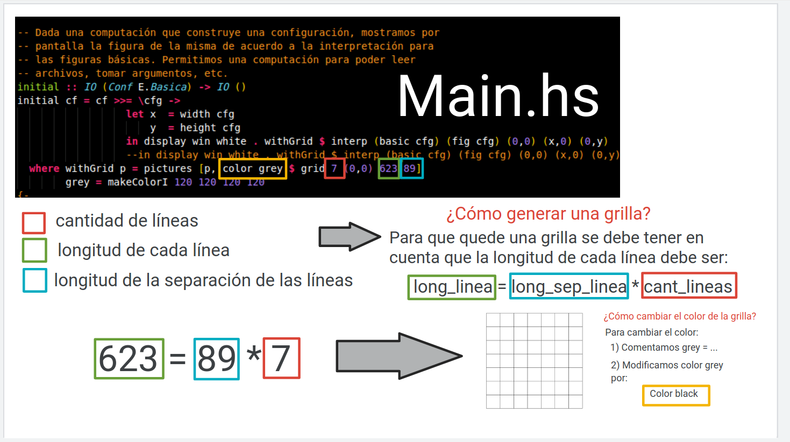

# Paradigmas de la programación - 2021
## Contenido
- [Tarea](#tarea)
- [Preguntas](#preguntas)
- [Respuestas](#respuestas)
    - [1. a)](#respuesta-1.-a)
    - [1. b)](#respuesta-1.-b)
    - [2)](#respuesta-2)
    - [3)](#respuesta-3)
- [Nuestra experiencia](#nuestra-experiencia)

## Tarea
Un readme breve donde comentan su experiencia y responden las preguntas que están a continuación. Indicar acá si usan otra biblioteca.

## Preguntas
Las siguientes preguntas deben ser respondidas correctamente, con el mayor grado
de precisión y claridad que puedan.

 1. a) ¿Por qué están separadas las funcionalidades en los módulos indicados?
    Explicar detalladamente la responsabilidad de cada módulo.
	
	b) ¿Harían alguna modificación a la partición en módulos dada?
    Justificar. Advertencia: Si hacen una buena partición, se las chorearemos
    para el año que viene.

 2. "¿Por qué las funciones básicas no están incluidas en la definición del lenguaje, y en vez es un parámetro del tipo?". Debería decir "¿Por qué las imágenes básicas ...?". Es decir, por qué creen que no se embeben directamente las imágenes, y en vez se utiliza un tipo abstracto.

 3. Explique cómo hace `Interp.grid` para construir la grilla, explicando cada
    pedazo de código que interviene.

## Respuestas
### Respuesta 1. a)
Están seraparadas las funcionalidades en los módulos indicados porque: nos permite que sea más legible y entendible de dónde a dónde cada módulo trabaja.</p>
El dividir los módulos nos permite dividir un problema grande, en problemas más chicos y al ser modulos independientes se puede testear sus funcionalidades por separado. Así nos podemos asegurar que lo que venimos haciendo funciona y no nos afectará lo que se esté realizando actualmente.
En el módulo `Dibujo.hs` se realiza la declaración de la sintaxis de nuestro lenguaje de figuras, definiendo los constructores del tipo `Dibujo` y las funciones que podremos utilizar con ellas.</p>
Luego el módulo `Interp.hs` se encarga de realizar la semantica de nuestro lenguaje, dando una interpretación geometrica real utilizando vectores. Finalmente `Main.hs` es el módulo que nos permite realizar los llamados a otros módulos y configurarlos para realizar los dibujos mediante la librería Gloss.</p>

### Respuesta 1. b) 
No se nos ocurre otra partición de los módulos. </p>

### Respuesta 2
("¿Por qué las imágenes básicas no están incluidas en la definición del lenguaje, y en vez es un parámetro del tipo?". Debería decir "¿Por qué las imágenes básicas ...?". Es decir, por qué creen que no se embeben directamente las imágenes, y en vez se utiliza un tipo abstracto)</p>

Las imágenes/figuras básicas no están incluídas en la definición del lenguaje porque cada uno puede darle la interpretación que quiere. Se utiliza un tipo abstracto porque hay infinitas figuras, y dar la definición de una figura básica depende totalmente del que la quiera crear.</p>

### Respuesta 3
Nuestro `Interp.grid`:
```haskell
grid :: Int -> Vector -> Float -> Float -> Picture
grid n v sep l = pictures [ls, translate 0 (l * toEnum n) (rotate 90 ls)]
    where ls = pictures $ take (n + 1) $ hlines v sep l
```
Es una grilla de `n` líneas, comenzando en `v` (vector) con una separación de `sep` y una longitud de `l` (usamos composición para no aplicar este argumento)

Entonces:
```haskell
    pictures [ls, translate 0 (l * toEnum n) (rotate 90 ls)]
```
Tenemos que `ls` solo tiene `n` líneas verticales y falta agregarle otras `n` lineas horizontales de tal forma que queden superpuestas, para esto usamos `rotate 90` de `ls`, y luego con `translate` lo trasladamos a la posición en donde quedaría superpesta con `ls`.

```haskell
    ls = pictures $ take (n + 1) $ hlines v sep l
```
En `ls` se contruye uniendo `n` lineas en una sola figura, las lineas se construyen en `hlines`


(Ver en navegador)
<p align="center">
  
</p>

<p align="center">
  
</p>

Dónde `Interp.hlines`:
```haskell
hlines :: Vector -> Float -> Float -> [Picture]
hlines (x, y) mag sep = map (hline . (*sep)) [0..]
  where hline h = line [(x, y + h),(x + mag, y + h)]
```
```haskell
[0..] :: (Num a, Enum a) => [a]
```

En Haskell:
Los símbolos que se permite usar para definir operadores son: `#`, `\$`, `%`, `&`, `*`, `+`, `.`,  `/`, `<`, `=`, `>`, `?`, `@`, `\`, `^`, `|`, `-`

El `f . g` en Haskell es composición de funciones de f y g

Y en `Main.hs`
```haskell
    where withGrid p = pictures [p, color grey $ grid 10 (0,0) 100 10]
```

dónde `p`:
```haskell
    p = $ interp (basic cfg) (fig cfg) (0,0) (x,0) (0,y)
```
y `grey`:
```haskell
    grey = makeColorI 120 120 120 120
```
Entonces 
```haskell
    in display win white . withGrid $ interp (basic cfg) (fig cfg) (0,0) (x,0) (0,y)
```

```haskell
    withGrid p = pictures [(interp (basic cfg) (fig cfg) (0,0) (x,0) (0,y)), color (makeColorI 120 120 120 120) $ grid 10 (0,0) 100 10]
```

```haskell
    in display win white . (pictures [(interp (basic cfg) (fig cfg) (0,0) (x,0) (0,y)), color (makeColorI 120 120 120 120) $ grid 10 (0,0) 100 10]) $ interp (basic cfg) (fig cfg) (0,0) (x,0) (0,y)
```

## Nuestra experiencia

Estuvimos trabajando a través de Live share de Visual Studio Code, con discord como canal de comunicacón, y usando el guide.md con las indicaciones.